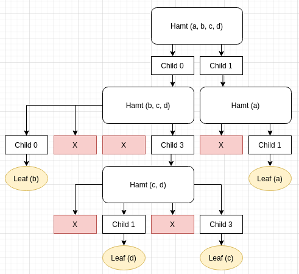

# Announcing dusk-hamt 0.2-rc.0

The HAMT in dusk-hamt stands for Hash Array Mapped Trie. A Hamt can be thought of as a tree of nested hash-maps.

The `path` that one value takes down the tree is determined by its cryptographic hash. Say if we want to insert the string "Hello World" and its hash is `d2a84f4b8b650937ec8f73cd8be2c74add5a911ba64df27458ed8229da804a26` in hex.

the HAMT is also based on each tree having 4 children, so the path that can be chosen in each step is `0..3`, which is 2 bits.

Our hash starts with `d` which is a hexadecimal representation of the binary string `00001101`, which encodes a whole 4 steps of the path.

`00 00 11 01` translates into the path `[0, 0, 3, 1]` and so on. When we walk the tree we will eventually find the value, or reach a dead-end where we can conclude the value is not in the tree.

## Features

Since each element will always have a fixed path in the tree, we can also construct merkle-proofs that a given element X is _not_ in a tree, by just providing a merkle-certified branch with a matching root, and showing that this does not indeed contain value X.

## Structure

As opposed to nstack, there is no guarantee that leaves are at the same distance from the root, instead they are pseudo-randomly distributed over all possible paths. This is a consequence of the also pseudo-random hash function used to decide the leaf paths.

